# PanicleCraft Images

## All items in creative tab

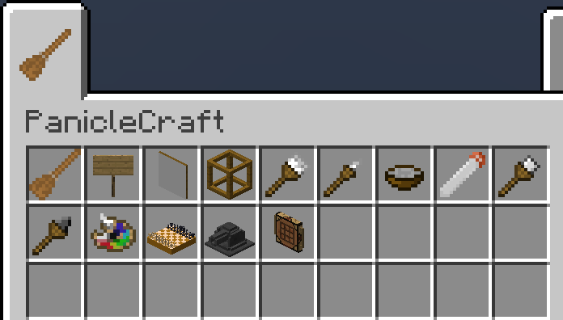

## Painting using a Paint Brush

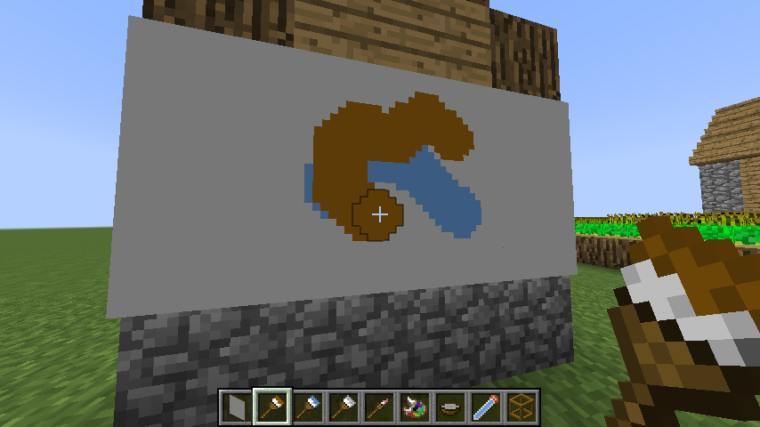

## Painting using a Small Paint Brush

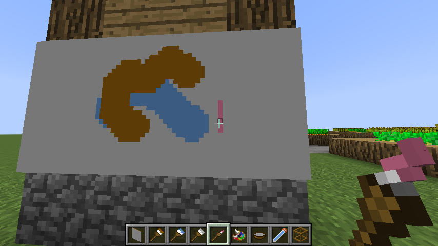

## Viewing painting using `/paniclecraft painting view` command

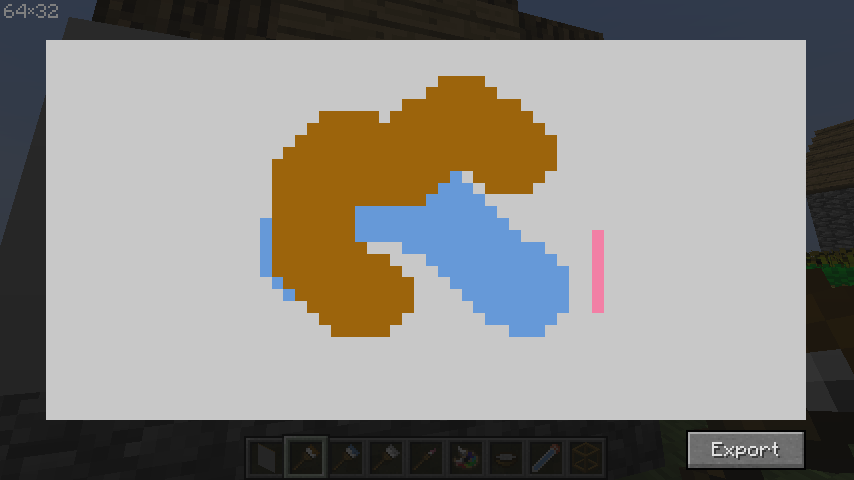

## Palette interface

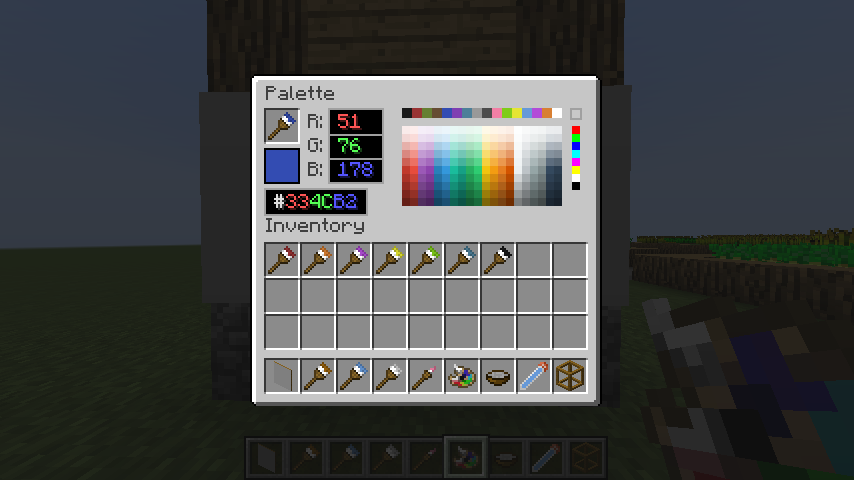

## Paint Brush tooltip

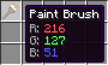

## Paint Brush colorization

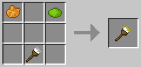

## Painting on frame

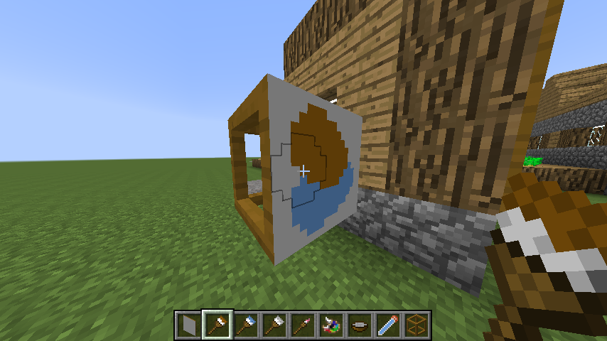

## Frame on head

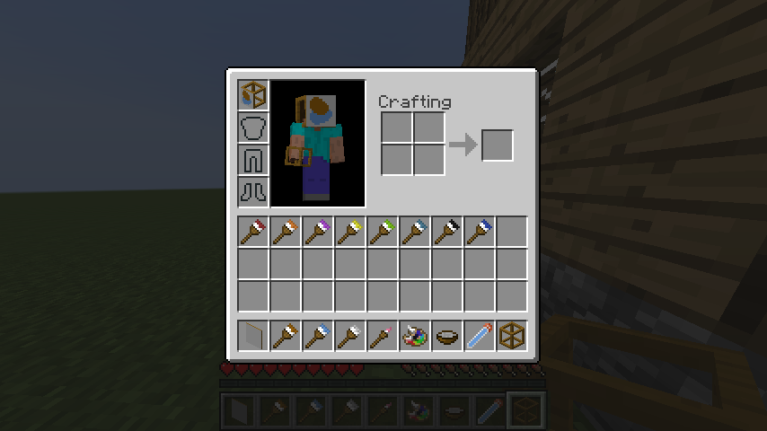

## Paint on block, make graffiti (disabled by default)

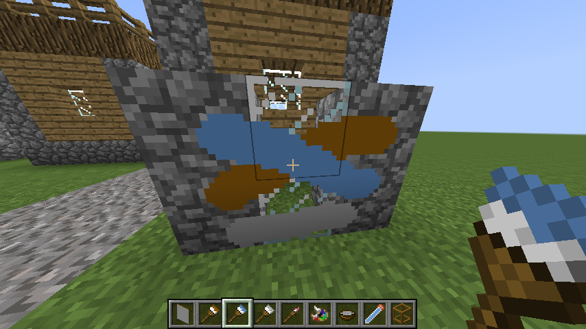

## Remove paint from block (disabled by default)

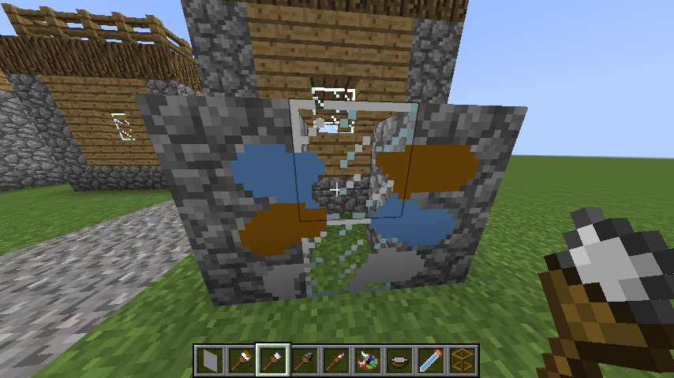

## Chess board

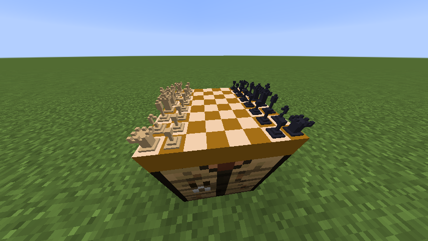

## Advanced sign

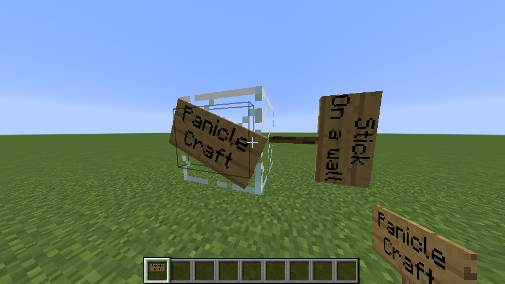

## Advanced sign interface

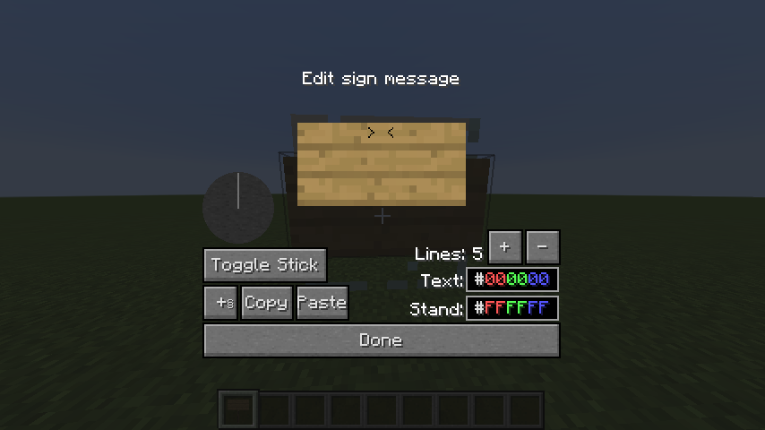

## Item cannon

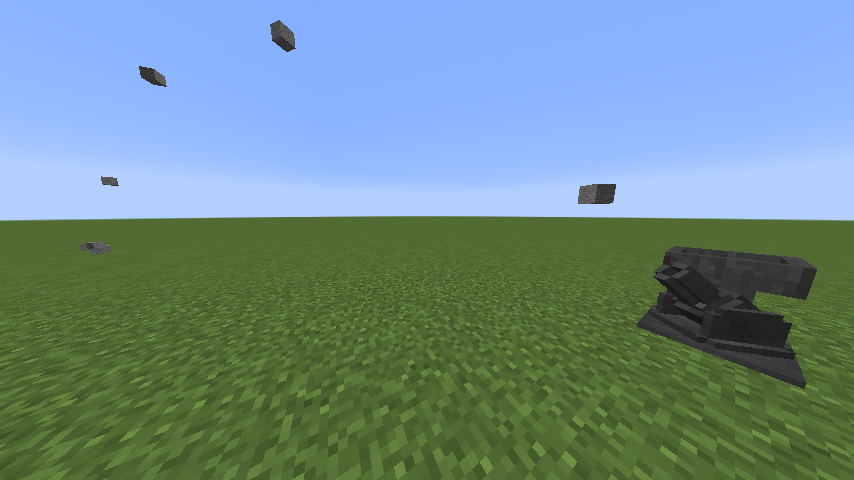
