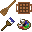

# PanicleCraft 

PanicleCraft is a mod with a miscellaneous components. **Open [images](IMAGES.md) to see how they looks like.**

## Components

### Paint brushes, paintings, graffiti

Place a canvas and paint on it using brushes. Brushes can also paint on blocks, make graffiti, but this feature is disabled by default.

Use dyes to change brushes color in a crafting table. Palette can set any color to brush.

Canvas can be placed inside the frame on all sides. Thus, you can place a block with different pictures on the sides. To remove a painting from a frame, right-click with an empty hand while sneaking.

Painted picture can be exported in painting view. Also having permission you can import images into painting.

Paintings can be combined in a crafting table and copied on an anvil.

### Chess

Chess board can be placed in world. It saves the state of the game on a break. The game history can be copied.

### Broom

Broom can collect items around by right click.

### Advanced sign

Advanced sign can be placed in many shapes with various colors and number of lines.

### Cannon

Cannon can shoot items in a given direction.

### Portable Workbench

Portable Workbench allows you to craft things on the go, but consumes durability.

## Configuration

Here is only highlight of some config parameters, see all of them in `paniclecraft.cfg`

### Palette

Palette is not craftable by default and available only in creative. To enable crafting recipe change the config parameter `painting` → `craftingRecipePalette` to `true`.

### Graffiti

Graffiti, PaintOnBlock feature is disabled by default. To enable it change the config parameter `painting` → `allowPaintOnBlock` to `true`.
Also you should enable crafting recipes of paint removers by changing the config parameters `painting` → `craftingRecipePaintRemoverFromStick`, `craftingRecipeSmallPaintRemoverFromStick` to `true`.

### Editview

Op players can open painting editview gui with import feature by `/paniclecraft painting editview` command. To allow this for any player change the config parameter `painting` → `allowPaintingEditView` to `true`.

### Disable components

You can disable any unwanted component by changing `enable` parameter in their config block to `false`.

## Versions

Now supported versions are `1.7.10` and `1.12.2`. Upgrades to newer versions planned to be someday, if you want help me with that, welcome to github.
